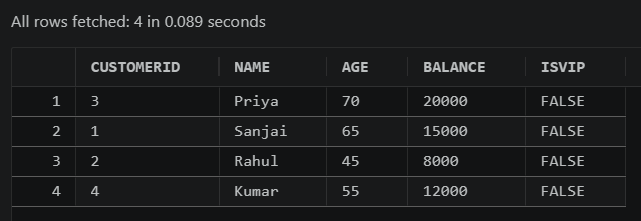
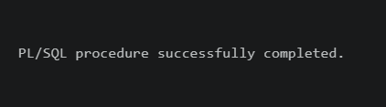
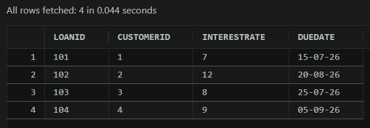

# Scenario 1: Senior Discount

## Problem Statement
Apply a 1% discount to loan interest rates for customers above 60 years old.

## Code
You can find the solution in [solution.sql](./solution.sql).

## Execution Evidence

### 1. Initial State (Before)

### 2. Execution Confirmation

### 3. Final State (After)
