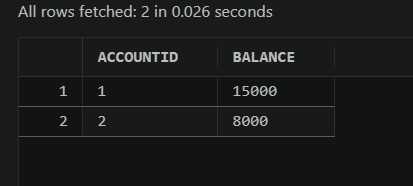
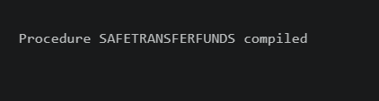
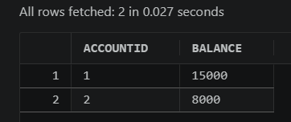

# Scenario 1: Safe Transfer Funds

### Objective
Create a stored procedure `SafeTransferFunds` that transfers funds between two accounts. The procedure must handle errors (such as insufficient funds) by logging an error message and ensuring that the transaction is rolled back to maintain data integrity.

### Implementation Details
* **Table Used**: `ACCOUNTS`
* **Logic**: 
    1. Check if the sender has sufficient balance.
    2. If funds are insufficient, raise a custom error.
    3. If funds are sufficient, update the sender and receiver balances.
    4. Include an `EXCEPTION` block to `ROLLBACK` in case of any database errors.

### Evidence
* **Initial State**: 
  
* **Execution**: 
  
* **Final State**: 
  